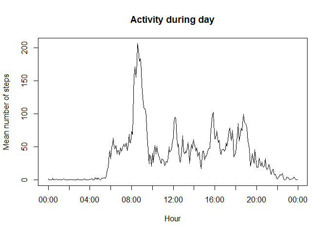

# Reproducible Research: Peer Assessment 1


## Loading and preprocessing the data
Show any code that is needed to

1. Load the data (i.e. read.csv())

2. Process/transform the data (if necessary) into a format suitable for your analysis


```r
#setwd(".../RepData_PeerAssessment1")
#There is the option to download the data from the internet
#url <- "https://d396qusza40orc.cloudfront.net/repdata%2Fdata%2Factivity.zip"
#download.file(url, "steps.csv")
#But we prefer work with the data from the repo
unzip("activity.zip")
activity <- read.csv("activity.csv")
library(lubridate)
#activity$time <- (strptime(paste(date, as.character(interval)), "%Y-%m-%d %H%M"))
print(names(activity))
```

```
## [1] "steps"    "date"     "interval"
```

## What is mean total number of steps taken per day?
For this part of the assignment, you can ignore the missing values in the dataset.

1. Make a histogram of the total number of steps taken each day

2. Calculate and report the mean and median total number of steps taken per day

```r
stepsPerDate <- aggregate(steps ~ date, activity, sum, na.rm=T)
meanStepsPerDay <- mean(stepsPerDate$steps)
medianStepsPerDay <- median(stepsPerDate$steps)
hist(stepsPerDate$steps, breaks = 1000 * (0:22), main = "Frequency of steps per day", xlab = "Steps per day")
abline(v = meanStepsPerDay, col = "blue", lw = 2)
```

 

```r
cat("The mean is", meanStepsPerDay, "steps.")
```

```
## The mean is 10766.19 steps.
```

```r
cat("The median is", medianStepsPerDay, "steps.")
```

```
## The median is 10765 steps.
```

## What is the average daily activity pattern?
1 Make a time series plot (i.e. type = "l") of the 5-minute interval (x-axis) and the average number of steps taken, averaged across all days (y-axis)
2 Which 5-minute interval, on average across all the days in the dataset, contains the maximum number of steps?

```r
stepsPerInterval <- aggregate(steps ~ interval, activity, mean, na.rm=T)
stepsPerInterval$interval <- as.character(sprintf("%04d", stepsPerInterval$interval))
stepsPerInterval$time <- strptime(stepsPerInterval$interval, "%H%M")
maxPerDay <- max(stepsPerInterval$steps, na.rm=TRUE)
maxTime <- stepsPerInterval$time[stepsPerInterval$steps == maxPerDay]
plot(stepsPerInterval$time, stepsPerInterval$steps, type="l", xlab="Hour", ylab="Mean number of steps", main="Activity during day")
```

 

```r
cat(paste("The interval with more activity, in average, is ", maxTime$hour, ":", maxTime$min, ".", sep=""))
```

```
## The interval with more activity, in average, is 8:35.
```

## Imputing missing values


## Are there differences in activity patterns between weekdays and weekends?
